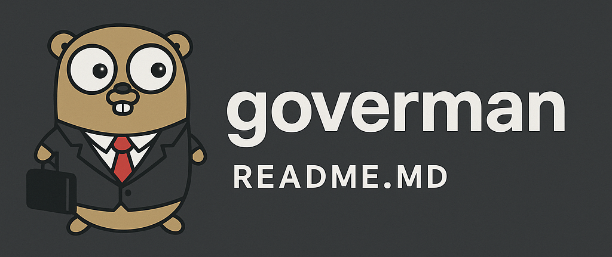

# goverman (Go Version Manager)

[](https://github.com/btassone/goverman/actions/workflows/test.yml)
[](https://go.dev/dl/)
[](https://github.com/btassone/goverman#supported-platforms)
[](LICENSE)

**goverman** is a simple and powerful Go version manager that allows you to install and manage multiple Go versions on your system. Unlike other version managers, goverman provides a unified tool called `gman` to easily install, uninstall, and switch between different Go versions without affecting your system's default Go installation.

## Quick Install

Install goverman with a single command:

```bash
# Using curl
curl -fsSL https://raw.githubusercontent.com/btassone/goverman/main/install.sh | bash

# Using wget
wget -qO- https://raw.githubusercontent.com/btassone/goverman/main/install.sh | bash
```

This will:
- Install `gman` to `/usr/local/bin`
- Set up your PATH automatically
- Install the man page (if available)

## Quick Uninstall

Completely remove goverman and all installed Go versions:

```bash
# Using curl
curl -fsSL https://raw.githubusercontent.com/btassone/goverman/main/uninstall.sh | bash

# Using wget
wget -qO- https://raw.githubusercontent.com/btassone/goverman/main/uninstall.sh | bash
```

This will:
- Remove the `gman` binary and man page
- Remove all gman-installed Go versions
- Clean up PATH entries from shell profiles
- Create backups of modified shell profiles

## Why goverman?

While tools like `gvm` (Go Version Manager) exist, many are no longer actively maintained. goverman fills this gap with:

- **Active maintenance** - Regular updates and bug fixes
- **Bootstrap capability** - Install Go on fresh systems without requiring Go
- **Modern Go support** - Always supports the latest Go releases
- **Simple interface** - One tool (`gman`) for all operations
- **CI/CD friendly** - Extensively tested across 12+ OS configurations
- **No dependencies** - Pure bash implementation, works everywhere bash does

## Overview

Goverman is a Go version management tool that helps developers who need to work with multiple Go (Golang) versions by:
- **Bootstrapping Go** on fresh systems without requiring an existing Go installation
- Installing specific Go SDK versions alongside your default Golang installation
- Managing multiple Go compiler versions without conflicts
- Providing easy Go version switching capabilities for different projects
- Supporting multiple architectures (amd64, arm64, armv6l) across Linux, macOS, and Windows
- Offering both official (`go install`) and direct download installation methods
- **Bulk uninstalling** all goverman-managed Go versions with one command
- Handling broken Go installations gracefully with automatic recovery

## Features

### 🚀 Bootstrap Installation
Install Go on fresh systems without any prerequisites:
```bash
gman bootstrap          # Latest stable version
gman bootstrap 1.23.9   # Specific version
```

### 📦 Multiple Installation Methods
- **Official**: Uses `go install` (requires existing Go)
- **Direct**: Downloads binaries from go.dev (works without Go)

### 🔄 Version Management
- Install multiple versions side-by-side
- Switch between versions easily
- Set any version as the default `go` command
- List all installed versions with status indicators

### 🗑️ Clean Uninstallation
- Remove individual versions: `gman uninstall 1.23.9`
- Remove all versions at once: `gman uninstall-all`

### 🌍 Cross-Platform Support
- Linux (12+ distributions tested)
- macOS (Intel & Apple Silicon)
- Windows (via Git Bash/WSL)
- Multiple architectures: amd64, arm64, armv6l

### 🛡️ Robust Error Handling
- Handles broken Go installations gracefully
- Detects and warns about PATH conflicts
- Automatic fallback from official to direct method

## Prerequisites

- Bash-compatible shell (bash, zsh, fish, etc.)
- curl or wget (required for downloading Go)
- Standard UNIX tools (tar, grep, sed)
- Go 1.17+ (only for the `install` command; not needed for `bootstrap`)

## Installation

Clone this repository:

```bash
git clone https://github.com/btassone/goverman.git
cd goverman
chmod +x gman
```

Add to your PATH:
```bash
sudo ln -s $(pwd)/gman /usr/local/bin/gman
# Or add the goverman directory to your PATH
```

## Shell Support

Goverman automatically detects your shell and adds the Go binary path to the appropriate configuration file:

- **Bash**: Updates `~/.bashrc` or `~/.bash_profile`
- **Zsh**: Updates `~/.zshrc` or `~/.zprofile`
- **Fish**: Updates `~/.config/fish/config.fish`
- **Other shells**: Falls back to `~/.profile`

The installer will:
1. Detect your default shell from the `$SHELL` environment variable
2. Show which shell was detected
3. Prompt you to add the PATH to the correct profile file
4. Provide instructions to apply changes immediately

## Usage

The `gman` tool provides all functionality through a single command:

```bash
gman <command> [options]
```

### Commands

#### Bootstrap Go (For Fresh Systems)

If you don't have Go installed yet, use the bootstrap command to install Go without any prerequisites:

```bash
# Install the latest stable Go version
gman bootstrap

# Install a specific Go version
gman bootstrap 1.23.9
```

The bootstrap command:
- Downloads Go directly from the official website
- Installs to `/usr/local/go` (may require sudo)
- Automatically configures your PATH
- Works on systems without any Go installation

#### Installing a Go Version

The install command supports two installation methods:

**Official Method (default)** - Uses `go install` to download and install Go versions:
```bash
gman install 1.23.9      # Specific version
gman install latest      # Latest stable version
```

**Direct Method** - Downloads Go binaries directly from the official Go website:
```bash
gman install 1.23.9 direct
```

**Install and Set as Default** - Install a version and set it as the default `go` command:
```bash
gman install 1.23.9 --default
```

#### Uninstalling Go Versions

Remove a specific Go version:
```bash
gman uninstall 1.23.9
```

Remove all goverman-installed Go versions:
```bash
gman uninstall-all
```

The `uninstall-all` command will:
- Find all Go versions installed by gman
- Prompt for confirmation before removing
- Clean up orphaned SDK directories
- Remove the default symlink if present

#### List Installed Versions

View all Go versions installed by goverman:
```bash
gman list
```

#### List Available Versions

View available Go versions that can be installed:
```bash
# Show recent versions (top 20)
gman list-available

# Show all available versions
gman list-available --all
```

#### Set Default Version

Set an installed version as the default `go` command:
```bash
gman set-default 1.23.9
```

#### Help

Show usage information:
```bash
gman help
```

### Quick Command Reference

```bash
# Bootstrap (for fresh systems without Go)
gman bootstrap                  # Install latest stable Go
gman bootstrap 1.23.9           # Install specific version

# Install additional Go versions
gman install latest             # Install latest stable version
gman install latest --default   # Install latest and set as default
gman install 1.23.9             # Official method (requires Go)
gman install 1.23.9 direct      # Direct download method
gman install 1.23.9 --default   # Install and set as default

# Manage versions
gman list                       # List installed versions
gman list-available             # List available versions
gman set-default 1.23.9         # Set default go command
gman uninstall 1.23.9           # Remove a version
gman uninstall-all              # Remove all versions

# Other
gman version                    # Show gman version
gman help                       # Show help
```

### Using Installed Go Versions

After installation, versioned binaries are available in your PATH:

```bash
# Use a specific version
go1.23.9 version

# Run go commands with a specific version
go1.23.9 build ./...
go1.23.9 test ./...
```

### Testing gman

Run the automated test suite to verify gman works correctly:

```bash
./test-go-scripts.sh
```

The test suite includes:
- `test-go-scripts.sh` - Main installation and functionality tests
- `test-path-setup.sh` - PATH configuration tests
- `test-list-available.sh` - Version listing tests
- `test-distro-detection.sh` - Linux distribution detection tests
- `test-alpine-detection.sh` - Alpine/musl libc detection tests
- `test-bootstrap.sh` - Bootstrap command functionality tests
- `test-uninstall-all.sh` - Bulk uninstall functionality tests

These tests verify:
- Bootstrap installation on fresh systems
- Both installation methods (official and direct)
- Correct version installation
- Reinstallation scenarios
- Set-default functionality
- Distribution detection accuracy
- Bulk uninstall operations
- Handling of broken Go installations
- Clean up test installations

## How It Works

1. **gman**: A unified tool that combines all functionality:
   - **bootstrap**: Installs Go on fresh systems without requiring existing Go
     - Downloads directly from go.dev
     - Installs to `/usr/local/go`
     - Configures PATH automatically
   - **install**: Creates versioned Go binaries (e.g., `go1.23.9`)
     - Installs to `$GOBIN` or `$GOPATH/bin`
     - Sets up PATH if needed
     - Supports multiple architectures automatically
     - Can optionally set the installed version as default
   - **uninstall**: Removes the versioned binary and cleans up the associated GOROOT directory
   - **uninstall-all**: Removes all goverman-managed Go versions at once
   - **list**: Shows all installed Go versions and identifies the default
   - **set-default**: Creates a symlink to use a specific version as the default `go` command
   - **help**: Shows usage information

2. **test-go-scripts.sh**:
   - Automated testing of gman functionality
   - Tests install/uninstall operations
   - Verifies set-default functionality
   - Ensures gman works correctly across different scenarios

## Supported Platforms

### Operating Systems

- **Linux**
  - Standard distributions (Ubuntu, Debian, Fedora, etc.)
  - Enterprise distributions (AlmaLinux, CentOS, RHEL, Rocky Linux)
  - SUSE-based distributions (openSUSE Leap, openSUSE Tumbleweed, SLES)
  - Arch-based distributions (Arch Linux, Manjaro, EndeavourOS)
  - Source-based distributions (Gentoo, Funtoo)
  - Independent distributions (Slackware)
  - Alpine Linux (musl libc) - with limitations*
- **macOS**
  - macOS 12 (Monterey) and later
  - Both Intel and Apple Silicon
- **Windows**
  - Windows 10/11 via Git Bash or WSL
  - Windows Server 2019 and later

### Architectures

- **amd64** (x86_64) - Intel/AMD 64-bit processors
- **arm64** (aarch64) - ARM 64-bit processors (Apple Silicon, AWS Graviton, etc.)
- **armv6l** - ARM 32-bit processors (Raspberry Pi, etc.)

### Distribution Detection

Goverman automatically detects your Linux distribution and displays it during installation. This helps with:
- Diagnosing compatibility issues
- Providing distribution-specific recommendations
- Better support and troubleshooting

Detected distributions include: Ubuntu, Debian, Fedora, AlmaLinux, CentOS, RHEL, Rocky Linux, openSUSE, SLES, Arch Linux, Gentoo, Alpine, Slackware, and more.

### Notes on Alpine Linux Support

Alpine Linux uses musl libc instead of glibc, which can affect Go binary compatibility:
- Official Go binaries from go.dev are built for glibc and may have limited compatibility
- For best results on Alpine, consider using Alpine's package manager: `apk add go`
- The direct installation method may work better than the official method
- Some older Go versions may not work at all due to libc differences

## Testing

Goverman has comprehensive test coverage across multiple platforms:
- Automated CI/CD tests run on every push and pull request
- Tests complete in ~2 minutes for most platforms
- Tests run on 12+ different OS configurations including:
  - Ubuntu (latest, 22.04)
  - macOS (latest, 13)
  - Windows (latest via Git Bash)
  - Alpine Linux (musl libc)
  - AlmaLinux 8 & 9
  - openSUSE Leap & Tumbleweed
  - Arch Linux
  - Gentoo
  - Slackware
- All tests run in parallel with `fail-fast: false` for complete results
- Run tests locally with any of the test scripts listed above

## Contributing

Pull requests are welcome! Please ensure all tests pass by running `./test-go-scripts.sh` before submitting.

## License

This project is licensed under the GNU General Public License v3.0 - see the [LICENSE](LICENSE) file for details.
